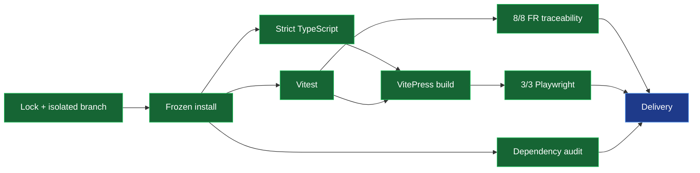

# A+ Quality Loop — 2026-07-18

## Cockpit

| Control | State | Exact evidence |
|---|---|---|
| Repository | GREEN | `KooshaPari/PhenoHandbook`, writable (`ADMIN`), not archived |
| Isolation | GREEN | `chore/aplus-quality-loop-20260717`, based on `origin/main` at `d50448f` |
| Deterministic install | GREEN | `bun install --frozen-lockfile`: 164 installs / 214 packages, 0 changes |
| Static analysis | GREEN | `tsc --noEmit`: 1/1 command passed with `strict: true` |
| Unit/governance/requirements | GREEN | Vitest: 51/51 tests passed across 3/3 files |
| Browser journeys | GREEN | Playwright Chromium: 3/3 journeys passed |
| Requirement traceability | GREEN | 8/8 functional requirements have executable validators (100%) |
| Build | GREEN | VitePress: 1/1 client/server bundle and page-render build passed |
| Security | GREEN | `bun audit --audit-level=high`: 0 vulnerabilities |

## Progress Bars

- Quality gates: `██████████` 7/7 (install, static analysis, tests, traceability, E2E, build, audit)
- Requirement traceability: `██████████` 8/8 = 100% (target >=85%)
- Defined critical journeys: `██████████` 3/3 = 100%
- Workflow policy checks: `██████████` 42/42 = 100%

Baseline deltas are measured, not estimated:

| Gate | Baseline | Final |
|---|---:|---:|
| Frozen install | 0/1 | 1/1 |
| Combined baseline test report | 40 pass, 4 fail, 1 collection error | 51/51 pass |
| Workflow policy violations | 9 | 0 |
| Completed browser journeys | 0/2 pass; third did not complete | 3/3 pass |
| High-severity dependency findings | 1 | 0 |
| Production build | 1/1 | 1/1 |

## DAG

## WBS

1. Baseline: prove repository ownership, isolation, install, test, build, E2E, and audit state.
2. Supply chain: synchronize `bun.lock`, pin actions, remove floating runners, patch Vite.
3. Quality: add strict TypeScript analysis and eliminate fail-open CI commands.
4. Traceability: map all eight functional requirements to executable Vitest checks.
5. Journey proof: run the built VitePress site on an isolated port and test three critical routes.
6. Delivery: rerun all gates, commit, push without force, and open a PR.

## Verification Spec

The lane is complete only when all seven gates are green. Traceability coverage is defined as
`requirements with at least one executable validator / total requirements in FUNCTIONAL_REQUIREMENTS.md`.
The numerator is 8 and denominator is 8. Journey coverage is defined as
`passing critical browser journeys / critical browser journeys declared in tests/e2e/smoke.spec.ts`;
the numerator is 3 and denominator is 3.

## ADR

**ADR-QL-001: Use Bun as the single deterministic package path.** Accepted. The repository
declares Bun and commits `bun.lock`; CI now uses frozen Bun installs instead of mutable npm installs.

**ADR-QL-002: Test the production preview, not the development server.** Accepted. E2E first builds
the site, then serves the emitted artifact on port 4173. Port 3000 is occupied by an unrelated local
service and was the root cause of the misleading baseline browser failures.

**ADR-QL-003: Replace external fail-open Rust gates with repository-native strict gates.** Accepted.
This is a documentation/TypeScript repository; the quality and FR workflows now execute local,
non-optional Bun/TypeScript/Vitest gates and propagate failures.

## Risk-Control Register

| Risk | Control | Verification |
|---|---|---|
| Mutable dependencies | Committed Bun lock + frozen install | 1/1 pass, 0 lock changes |
| Vulnerable dev server dependency | Override Vite to patched 6.4.3 | 0 audit findings |
| Workflow supply-chain drift | SHA pinning test over every workflow | 42/42 checks pass |
| Fail-open quality checks | Remove `continue-on-error`, `|| true`, and no-test fallback | CI workflow review + tests |
| Type regressions | Strict project TypeScript config | `tsc --noEmit` passes |
| Requirement orphaning | One named executable check per FR | 8/8 mapped |
| Browser false positives | Built-site preview on isolated port | 3/3 Playwright journeys pass |
| Generated artifact drift | Deterministic VitePress build | 1/1 build passes |
| Historical/generated dead links | Keep the 99-link backlog explicit; enforce configured critical routes and E2E instead of a false fail-open scanner | FR-PH-006 validator + 3/3 journeys |

## Traceability Matrix

| Requirement | Executable evidence | Coverage |
|---|---|---:|
| FR-PH-001 Pattern library | `requirements.test.ts`: source evidence across five domains | 1/1 |
| FR-PH-002 Anti-pattern catalog | Security/performance catalog assertions | 1/1 |
| FR-PH-003 Methodology guides | TDD, BDD, deployment assertions | 1/1 |
| FR-PH-004 Domain practices | Auth, caching, observability, data assertions | 1/1 |
| FR-PH-005 Technology guidance | Rust, Go, TypeScript, Python example assertions | 1/1 |
| FR-PH-006 Search/navigation | Local search, sidebar, navigation assertions + E2E | 1/1 |
| FR-PH-007 Checklists | Quality, security, performance, deployment assertions | 1/1 |
| FR-PH-008 Version/history | SemVer, changelog, ADR, migration assertions | 1/1 |
| **Total** | **Eight named executable validators** | **8/8 (100%)** |

Traceability coverage proves that every FR is continuously checked against concrete repository
evidence. It does not claim that every aspirational acceptance criterion or roadmap target is complete.
